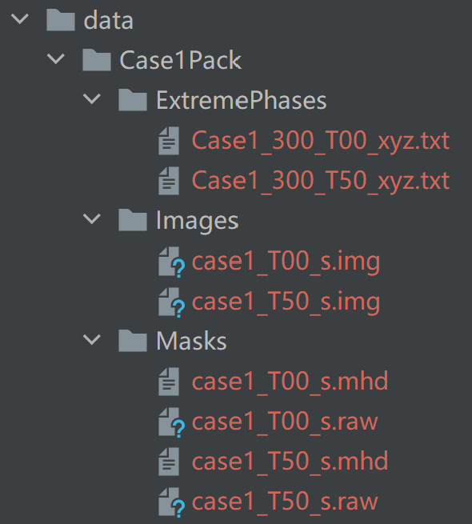

Code for "Neural Network-Based Representation of Medical Images for Deformable Registration"

---

## How to evaluate model.

1. Clone this repository
2. Install necessary package by pipe
3. I have put a pre-trained model in output folder
4. Run main.py
5. you will get an something like
> 0.9514981609298885 0.6161734866333188
6. It was the DIR-Lab case1 TRE result, which is consistence with manuscript.

---

## How to train image model and deformable model.

1. Clone this repository
2. Install necessary package by pipe
3. Download image data from DIR-Lab
4. Put DIR-Lab data into data folder like this

5. Uncomment the line 280, 281, 284 and 287 in the main.py
6. Run main.py
7. Change configure as you want in main.py
